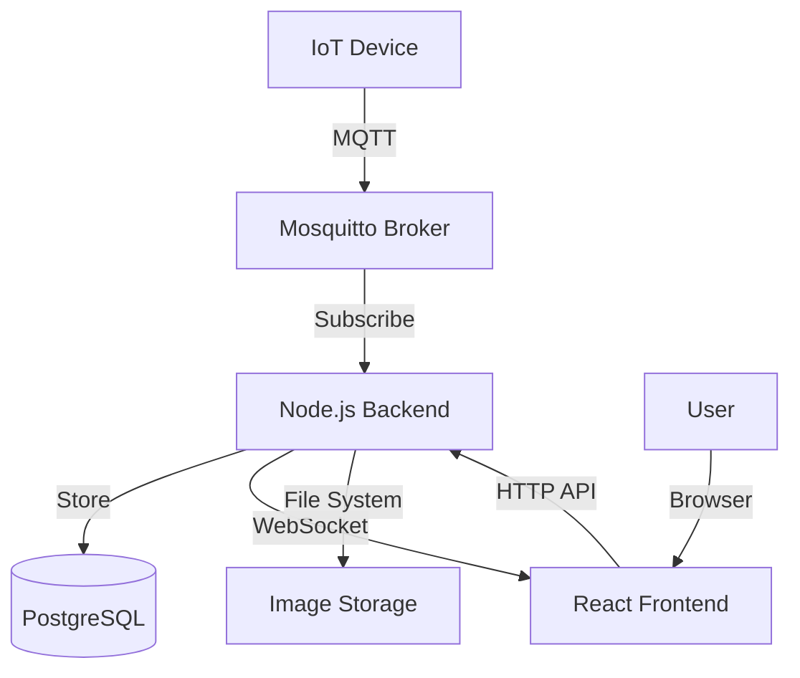

# MQTT IoT Dashboard

A full-stack IoT device management system with real-time telemetry monitoring, time series visualization, alarm management, and image capture capabilities.

## Features

- User Authentication with secure password hashing
- Device Management for multiple IoT devices
- **Device Ownership History** - Transfer devices between users while preserving historical data access
- Time Series Visualization with real-time charts
- Alarm System with acknowledgment tracking
- Image Capture and storage from IoT devices
- PostgreSQL for persistent storage
- MQTT Integration with authentication and ACLs
- Modern responsive UI with React + TypeScript

### Device Ownership & Historical Data

When a device is transferred from one user to another:
- The new user gains full control of the device and receives all future data
- The previous owner retains read-only access to historical data (telemetry, alarms, images)
- Historical devices are displayed separately in the UI with a "📜" icon
- All historical data remains associated with the original owner in the database
- Devices can be reassigned back to previous owners, reactivating their access

## Architecture



### Technology Stack

- **Frontend**: React + TypeScript + Vite + Recharts (port 5173)
- **Backend**: Node.js + Express + Socket.IO (port 3001)
- **MQTT Broker**: Mosquitto (TCP: 1883, WebSocket: 9001)
- **Database**: PostgreSQL 16 (port 5432)
- **Deployment**: Docker Compose

## Setup

### Prerequisites

- Docker and Docker Compose
- Git

### Installation

1. Clone the repository:
```bash
git clone <repository-url>
cd mqtt
```

2. Create environment configuration:
```bash
cp .env.example .env
```

3. Edit `.env` file and set your own secure passwords:
```env
# IMPORTANT: Change these values before deployment!
MOSQ_USER=your_admin_username
MOSQ_PASS=your_secure_password
DB_PASSWORD=your_database_password
BROKER_PASS=your_broker_password
```

4. Start all services:
```bash
docker compose up --build
```

5. Access the dashboard:
```
http://localhost:5173
```

### First Time Setup

1. Open the dashboard and register a new user account
2. Login with your credentials
3. Add a new device from the sidebar
4. Note your UUID (visible in the dashboard)
5. Use your UUID and password to connect IoT devices

## Backend API Reference

### Authentication Endpoints

#### Register User
```http
POST /register
Content-Type: application/json

{
  "username": "user123",
  "password": "securepass"
}
```

**Response:**
```json
{
  "status": "ok",
  "uuid": "ef63df7a-e80c-49e1-b526-1b69f9ad93c2"
}
```

#### Login
```http
POST /login
Content-Type: application/json

{
  "username": "user123",
  "password": "securepass"
}
```

**Response:**
```json
{
  "status": "ok",
  "uuid": "ef63df7a-e80c-49e1-b526-1b69f9ad93c2",
  "username": "user123"
}
```

### Device Management

#### Get User Devices
```http
GET /devices/:userUuid
```

**Response:**
```json
{
  "devices": [
    {
      "id": "device-001",
      "name": "Temperature Sensor",
      "created_at": "2026-01-13T10:00:00Z"
    }
  ]
}
```

#### Add Device
```http
POST /add-device
Content-Type: application/json

{
  "userUuid": "ef63df7a-e80c-49e1-b526-1b69f9ad93c2",
  "macAddress": "00_11_22_33_44_55",
  "deviceName": "Temperature Sensor"
}
```

#### Publish Command to Device
```http
POST /publish
Content-Type: application/json

{
  "userUuid": "ef63df7a-e80c-49e1-b526-1b69f9ad93c2",
  "macAddress": "00_11_22_33_44_55",
  "message": "reboot"
}
```

### Telemetry Data

#### Get Device Telemetry
```http
GET /telemetry/:userUuid/:macAddress?limit=100&sensor=temperature
```

Query Parameters:
- `limit` (optional): Number of records to return (default: 100)
- `sensor` (optional): Filter by sensor name

**Response:**
```json
{
  "data": [
    {
      "id": 1,
      "sensor_name": "temperature",
      "value": 25.5,
      "unit": "C",
      "timestamp": "2026-01-13T10:00:00Z",
      "message_id": "msg-123"
    }
  ]
}
```

### Alarm Management

#### Get User Alarms
```http
GET /alarms/:userUuid?limit=50
```

Query Parameters:
- `limit` (optional): Number of alarms to return (default: 50)

**Response:**
```json
{
  "alarms": [
    {
      "id": 1,
      "device_id": "device-001",
      "device_name": "Temperature Sensor",
      "severity": "critical",
      "message": "Temperature exceeded 50C",
      "acknowledged": false,
      "timestamp": "2026-01-13T10:00:00Z"
    }
  ]
}
```

#### Acknowledge Alarm
```http
POST /alarms/:alarmId/acknowledge
```

**Response:**
```json
{
  "status": "ok"
}
```

### Image Management

#### Get Device Images (Metadata)
```http
GET /images/:userUuid/:macAddress?limit=20
```

**Response:**
```json
[
  {
    "id": 1,
    "image_id": "img-001",
    "device_name": "Camera Sensor",
    "file_path": "uuid_macAddress_imageId_timestamp.png",
    "file_size": "3562844",
    "metadata": {
      "width": 1888,
      "height": 1750,
      "format": "png",
      "camera": "RealCamera"
    },
    "timestamp": "2026-01-13T10:00:00Z"
  }
]
```

#### Get Image File
```http
GET /images/:userUuid/:macAddress/:imageId/file
```

Returns the actual image file with appropriate `Content-Type` header.

## MQTT Topic Structure

### Topic Pattern
```
/{userUuid}/devices/{macAddress}/{messageType}
```

### Message Types

#### 1. Device Self-Registration (Device to Backend)

**Topic:** `/{userUuid}/devices`

**Device Registration Request:**

JSON Format:
```json
{
  "name": "My Device Name",
  "macAddress": "00:11:22:33:44:55"
}
```

Plain Text Format (deprecated):
```
My Device Name
```

**Registration Response (Backend to Device):**

**Topic:** `/{userUuid}/devices/register-response`

**Response Format:**
```json
{
  "name": "My Device Name",
  "macAddress": "00_11_22_33_44_55",
  "status": "created|existing|reassigned|error",
  "timestamp": "2026-01-22T10:15:00Z",
  "error": "Error message (only if status is error)"
}
```

**Example Registration Flow:**
```bash
# Device sends registration request
mosquitto_pub -h localhost -u <userUuid> -P <password> \
  -t "/<userUuid>/devices" \
  -m '{"name":"Temperature Sensor v2","macAddress":"00:11:22:33:44:55"}'

# Device subscribes to response topic
mosquitto_sub -h localhost -u <userUuid> -P <password> \
  -t "/<userUuid>/devices/register-response"
```

**Behavior:**
- MAC address format is converted from `00:11:22:33:44:55` to `00_11_22_33_44_55` for MQTT topics
- If device with same MAC exists for another user, it will be reassigned to the registering user
- If device with same MAC exists for same user, updates device name if different
- If new device, creates it in the database and returns status "created"
- Frontend is notified in real-time via Socket.IO when devices are registered/reassigned

#### 2. Telemetry (Device to Backend)

**Topic:** `/{userUuid}/devices/{macAddress}/telemetry`

**Single Reading:**
```json
{
  "sensor": "temperature",
  "value": 25.5,
  "unit": "C",
  "isBatch": false,
  "messageId": "msg-123"
}
```

**Batch Readings** (for battery conservation):
```json
{
  "sensor": "temperature",
  "value": [
    ["2026-01-13T10:00:00Z", 24.5],
    ["2026-01-13T10:05:00Z", 24.8],
    ["2026-01-13T10:10:00Z", 25.1]
  ],
  "unit": "C",
  "isBatch": true,
  "messageId": "batch-456"
}
```

**Mosquitto Example:**
```bash
mosquitto_pub -h localhost -u <userUuid> -P <password> \
  -t "/<userUuid>/devices/<macAddress>/telemetry" \
  -m '{"sensor":"temperature","value":25.5,"unit":"C","isBatch":false,"messageId":"msg-123"}'
```

#### 3. Commands/Acknowledgments (Backend to Device)

**Topic:** `/{userUuid}/devices/{macAddress}/commands`

**Acknowledgment Format:**
```json
{
  "type": "ack",
  "messageId": "msg-123",
  "status": "success",
  "recordCount": 1,
  "timestamp": "2026-01-13T10:15:00Z"
}
```

**Subscribe Example:**
```bash
mosquitto_sub -h localhost -u <userUuid> -P <password> \
  -t "/<userUuid>/devices/<macAddress>/commands"
```

#### 4. Images (Device to Backend)

**Topic:** `/{userUuid}/devices/{macAddress}/images`

**Message Format:**
```json
{
  "imageId": "img-789",
  "messageId": "msg-img-789",
  "data": "<base64-encoded-image>",
  "metadata": {
    "contentType": "image/jpeg",
    "width": 1920,
    "height": 1080,
    "camera": "CameraModel"
  }
}
```

**Send Image Example:**
```bash
mosquitto_pub -h localhost -u <userUuid> -P <password> \
  -t "/<userUuid>/devices/<macAddress>/images" \
  -m '{"imageId":"img-789","messageId":"msg-img-789","data":"'$(base64 -w 0 image.jpg)'","metadata":{"contentType":"image/jpeg"}}'
```

Images are stored in the Docker volume `images_storage` and served via the API.

#### 5. Alarms (Device to Backend)

**Topic:** `/{userUuid}/devices/{macAddress}/alarms`

**Message Format:**
```json
{
  "severity": "critical",
  "message": "Temperature exceeded 50C"
}
```

**Severity Levels:** `info`, `warning`, `critical`

**Send Alarm Example:**
```bash
mosquitto_pub -h localhost -u <userUuid> -P <password> \
  -t "/<userUuid>/devices/<macAddress>/alarms" \
  -m '{"severity":"critical","message":"Temperature exceeded 50C"}'
```

## Database Schema

### Tables

#### users
Stores user accounts with authentication credentials.

| Column | Type | Description |
|--------|------|-------------|
| id | SERIAL | Primary key |
| uuid | VARCHAR(255) | Unique user identifier (used for MQTT auth) |
| username | VARCHAR(255) | Unique username |
| password_hash | VARCHAR(255) | Bcrypt hashed password |
| created_at | TIMESTAMPTZ | Account creation timestamp |

#### devices
Stores IoT devices owned by users.

| Column | Type | Description |
|--------|------|-------------|
| id | VARCHAR(255) | Device identifier (primary key) |
| user_uuid | VARCHAR(255) | Foreign key to users.uuid |
| name | VARCHAR(255) | Device display name |
| created_at | TIMESTAMPTZ | Device registration timestamp |

#### telemetry
Stores time series telemetry data from IoT devices.

| Column | Type | Description |
|--------|------|-------------|
| id | SERIAL | Primary key |
| user_uuid | VARCHAR(255) | User identifier |
| device_id | VARCHAR(255) | Device identifier |
| device_name | VARCHAR(255) | Device display name |
| sensor_name | VARCHAR(255) | Sensor identifier |
| message | TEXT | Raw message content |
| value | NUMERIC | Parsed numeric value |
| unit | VARCHAR(50) | Unit of measurement |
| timestamp | TIMESTAMPTZ | Data timestamp |
| message_id | VARCHAR(255) | Optional message tracking ID |
| created_at | TIMESTAMPTZ | Database insertion timestamp |

#### alarms
Stores alarm and alert events from IoT devices.

| Column | Type | Description |
|--------|------|-------------|
| id | SERIAL | Primary key |
| user_uuid | VARCHAR(255) | User identifier |
| device_id | VARCHAR(255) | Device identifier |
| device_name | VARCHAR(255) | Device display name |
| severity | VARCHAR(20) | Alarm severity (info/warning/critical) |
| message | TEXT | Alarm message |
| acknowledged | BOOLEAN | Acknowledgment status |
| acknowledged_at | TIMESTAMPTZ | Acknowledgment timestamp |
| timestamp | TIMESTAMPTZ | Alarm timestamp |
| created_at | TIMESTAMPTZ | Database insertion timestamp |

#### images
Stores images captured by IoT devices.

| Column | Type | Description |
|--------|------|-------------|
| id | SERIAL | Primary key |
| user_uuid | VARCHAR(255) | User identifier |
| device_id | VARCHAR(255) | Device identifier |
| device_name | VARCHAR(255) | Device display name |
| image_id | VARCHAR(255) | Image identifier |
| image_data | TEXT | Base64 data (deprecated, nullable) |
| file_path | VARCHAR(500) | Path to image file in storage |
| file_size | BIGINT | File size in bytes |
| metadata | JSONB | Image metadata (format, dimensions, camera) |
| timestamp | TIMESTAMPTZ | Image capture timestamp |
| message_id | VARCHAR(255) | Optional message tracking ID |
| created_at | TIMESTAMPTZ | Database insertion timestamp |

### Indexes

All tables include optimized indexes for common query patterns:
- User and device lookups
- Timestamp-based queries
- Message ID tracking
- Acknowledgment status filtering

## Device Simulator

A test script is provided to simulate an IoT device:

```bash
chmod +x test-device.sh
./test-device.sh
```

**Modes:**
1. **Temperature sensor**: Sends random temperature readings
2. **Manual mode**: Enter custom sensor values
3. **Stress test**: Rapid data generation for testing

## Development

### Local Development

**Backend:**
```bash
cd backend
npm install
node server.js
```

**Frontend:**
```bash
cd frontend
npm install
npm run dev
```

### Environment Variables

See `.env.example` for all available configuration options. Key variables:

- **MOSQ_USER/MOSQ_PASS**: MQTT broker admin credentials
- **DB_USER/DB_PASSWORD**: PostgreSQL credentials
- **BROKER_USER/BROKER_PASS**: Backend MQTT client credentials
- **VITE_BACKEND_URL**: Frontend API endpoint

## Troubleshooting

### PostgreSQL Connection Issues
```bash
docker compose down -v
docker compose up --build
```

### MQTT Authentication Failed
- Use your **UUID** as the MQTT username (not your account username)
- Use the password you set during registration
- Ensure the Mosquitto container is running

### Frontend Cannot Connect to Backend
- Verify backend is running on port 3001
- Check `VITE_BACKEND_URL` in `.env`
- Ensure no firewall is blocking connections

### No Data in Charts
- Verify devices are publishing to correct topics: `/{uuid}/devices/{macAddress}/telemetry`
- Check message format matches the JSON specification
- Ensure numeric values are parseable
- Check time range selector in the dashboard

### Images Not Displaying
- Verify images are stored in the `images_storage` volume
- Check backend logs for file write errors
- Ensure image data is properly base64 encoded
- Verify file path in database matches actual file location

## License

MIT
